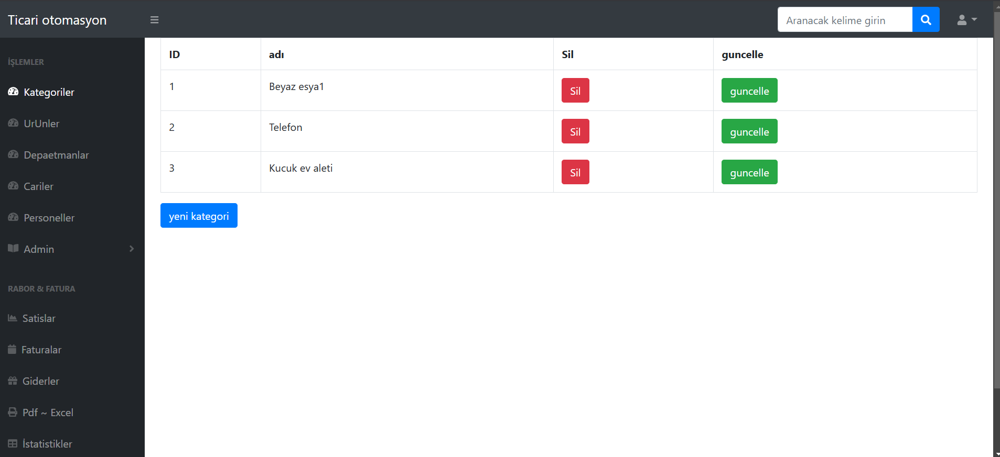
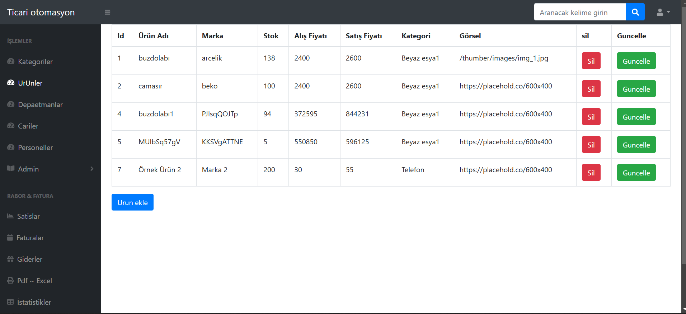
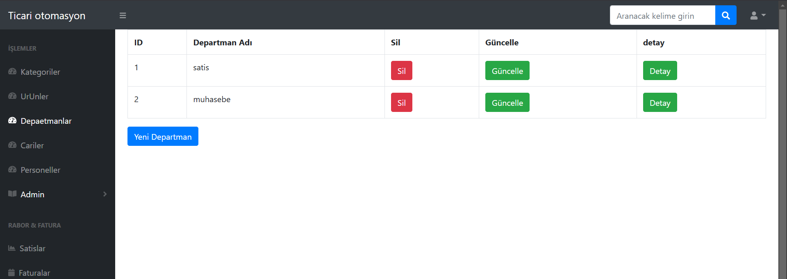
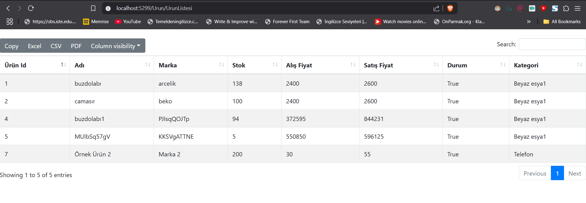

# ASP.NET MVC Projesi

Bu proje, ASP.NET MVC kullanılarak geliştirilmiş bir web uygulamasıdır. 

## Başlangıç

Bu projeyi kendi bilgisayarınızda çalıştırmak için aşağıdaki adımları takip edin.

### Gereksinimler

- [Visual Studio](https://visualstudio.microsoft.com/)
- .NET Framework
- phpmyadmin

### Kurulum

1. Depoyu klonlayın:
   ```bash
   git clone https://github.com/Muratoksuz01/SampleE_Commerve.git
   ```
2. Visual Studio ile projeyi açın.
3. Gerekli bağımlılıkları yükleyin.
4. Veritabanını yapılandırın ve migrate işlemlerini gerçekleştirin.
5. Projeyi çalıştırın.


## Ekran Görüntüleri

### Kategori


### Urunler


### Departmanlar

###  to  pdf & excel


